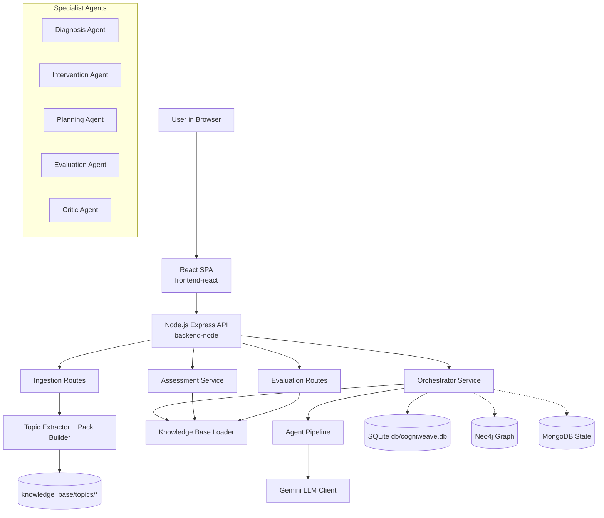
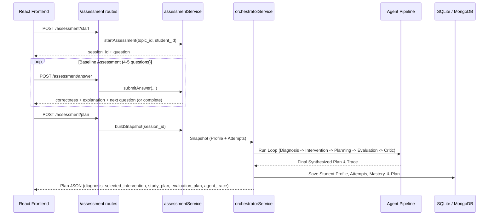
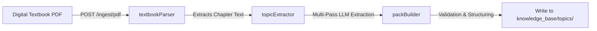

# CogniWeave: Personalized Learning & Multi-Agent Intervention System

CogniWeave is a grounded, multi-agent learning support system designed to support students tackling complex engineering topics. Unlike traditional tutoring systems or static chatbots, CogniWeave implements an adaptive **diagnose → intervene → plan → evaluate → replan** loop. It isolates a student's conceptual bottlenecks, designs custom study plans within their availability constraints, and tracks direct learning outcomes dynamically.

---

## Key Capabilities

1. **Multi-Agent Orchestration**: Coordinate five specialist agents (Diagnosis, Intervention, Planning, Evaluation, and Critic) in a generic, asynchronous loop powered by Gemini LLMs.
2. **Grounded Topic Packs**: Domain knowledge is separated into structured JSON topic packs. Each pack represents a domain with concept graphs, misconceptions, interventions, and evaluation rules.
3. **Automated Content Ingestion**: Ingest textbook chapters (raw text or PDF) and automatically extract concepts, construct prerequisites, generate misconceptions, and write practice problems.
4. **Interactive Learner Portal**: A premium, responsive React SPA containing baseline assessments, real-time feedback, study-path visualization, and checkpoint evaluations.
5. **Durable Persistence**: Track student profiles, attempts, mastery history, and intervention logs using a local SQLite instance, backed by Graph (Neo4j) and Document (MongoDB) schemas for scaling.

---

## System Architecture & Runtime Topology

CogniWeave decouples the UI representation, orchestration service, specialist LLM agents, and persistence layers.

### High-Level Topology



### Request Lifecycle (Assessment to Study Plan)

The following sequence details how baseline student attempts flow through the service to trigger multi-agent planning:



---

## Repository Directory Layout

```text
CogniWeave-Personalized-Learning-Intervention-System/
├── backend/                       # Legacy Python/FastAPI Backend (useful for reference)
│   └── app/                       # Configs, APIs, Services, and Python agents
├── backend-node/                  # Active Node.js Backend (Express)
│   ├── src/
│   │   ├── server.js              # Server entry point & middleware initialization
│   │   ├── config.js              # Environment settings parser & defaults
│   │   ├── routes/                # Express API endpoints
│   │   │   ├── health.js          # Health check endpoints
│   │   │   ├── assessment.js      # Baseline and student journey routes
│   │   │   ├── orchestrator.js    # Run loop orchestrator
│   │   │   ├── evaluation.js      # Checkpoint evaluation & mastery updates
│   │   │   └── ingest.js          # Textbook and PDF extraction handlers
│   │   ├── services/              # Core business logic
│   │   │   ├── database.js        # SQLite persistence client
│   │   │   ├── orchestratorService.js # Agent pipeline loop orchestration
│   │   │   ├── assessmentService.js   # Volatile session assessment manager
│   │   │   └── llmClient.js       # LLM fallback, retry, and request handler
│   │   ├── agents/                # Asynchronous specialist agent functions
│   │   │   ├── prompts.js         # Standardized agent instruction strings
│   │   │   ├── agentSchemas.js    # Zod output verification schemas
│   │   │   ├── diagnosisAgent.js  # Diagnoses concept bottlenecks
│   │   │   ├── interventionAgent.js # Generates targeted intervention options
│   │   │   ├── planningAgent.js   # Adapts plans to available student hours
│   │   │   ├── evaluationAgent.js # Designs outcome check rules
│   │   │   └── criticAgent.js     # Validates plan pedagogical soundness
│   │   └── ingestion/             # File parsing & pack builders
│   └── package.json
├── frontend-react/                # Main React + Vite SPA
│   ├── src/
│   │   ├── App.jsx                # UI step controller & State machine
│   │   ├── index.css              # Glassmorphic component styles
│   │   ├── context/               # Dark/Light theme state
│   │   └── components/            # UI components (Banner, Console, Steps)
│   └── package.json
├── knowledge_base/                # Structured topic knowledge packages
│   └── topics/
│       ├── sql_query_reasoning/   # SQL Query topic directory
│       │   ├── manifest.json      # Topic metadata
│       │   ├── concept_graph.json # Prerequisites & descriptions
│       │   ├── misconceptions.json# Catalog of common student errors
│       │   ├── interventions.json # Remediations library
│       │   ├── problems.json      # Predefined assessment problems
│       │   └── evaluation_rules.json # Mastery assessment thresholds
│       ├── os_synchronization/
│       └── dbms_normalization/
├── db/
│   ├── schema.sql                 # SQLite schema declaration
│   └── cogniweave.db              # SQLite active database
├── docs/                          # Detailed architecture, flows, and guidelines
│   ├── DETAILED_ARCHITECTURE.md   # Architectural breakdown
│   ├── COMPONENT_GUIDE.md         # Express & React Component breakdown
│   ├── FLOW_DIAGRAMS.md           # Learner journey and orchestration flows
│   ├── TEXTBOOK_TOPIC_CREATION_GUIDE.md # Tutorial for adding new topics
│   ├── KB_NEO4J_MONGODB_PLAN.md   # Neo4j and MongoDB migration strategy
│   └── API_USAGE_OPTIMIZATION.md  # LLM caching, retries, and constraints
├── .env                           # Local environment keys configuration
├── setup_packs.py                 # CLI script to bootstrap starter topic packs
└── requirements.txt               # Legacy Python pip packages list
```

---

## Specialist Agent Design

CogniWeave breaks down the learning intervention pipeline into five distinct agents. They communicate by writing and reading from a **shared memory state** object.

| Agent | Focus Area | Source File | Responsibilities |
| :--- | :--- | :--- | :--- |
| **Diagnosis Agent** | Concept Bottleneck Identification | [`diagnosisAgent.js`](file:///c:/Users/likhi/OneDrive/Pictures/Desktop/CollabProj/CogniWeave-Personalized-Learning-Intervention-System/backend-node/src/agents/diagnosisAgent.js) | Analyzes student attempts, error tags, self-reported issues, and confidence levels to find the root concept failing. |
| **Intervention Agent** | Custom Remediation Selection | [`interventionAgent.js`](file:///c:/Users/likhi/OneDrive/Pictures/Desktop/CollabProj/CogniWeave-Personalized-Learning-Intervention-System/backend-node/src/agents/interventionAgent.js) | Scans the grounded intervention database to choose a pedagogical activity matching the diagnosed misconception. |
| **Planning Agent** | Calendar & Study Scheduler | [`planningAgent.js`](file:///c:/Users/likhi/OneDrive/Pictures/Desktop/CollabProj/CogniWeave-Personalized-Learning-Intervention-System/backend-node/src/agents/planningAgent.js) | Builds a day-by-day roadmap scheduling practice and readings, respecting the student's weekly hour limitations. |
| **Evaluation Agent** | Outcome Verification Rules | [`evaluationAgent.js`](file:///c:/Users/likhi/OneDrive/Pictures/Desktop/CollabProj/CogniWeave-Personalized-Learning-Intervention-System/backend-node/src/agents/evaluationAgent.js) | Determines what assessment signals (solving time, retry thresholds) show that the intervention was successful. |
| **Critic Agent** | Plan Quality Inspector | [`criticAgent.js`](file:///c:/Users/likhi/OneDrive/Pictures/Desktop/CollabProj/CogniWeave-Personalized-Learning-Intervention-System/backend-node/src/agents/criticAgent.js) | Evaluates the overall output for logic, flow correctness, and pedagogical standards, recommending repairs if needed. |

---

## Persistence & Schema Design

CogniWeave uses an SQLite instance to store student metrics. The tables are described in [`db/schema.sql`](file:///c:/Users/likhi/OneDrive/Pictures/Desktop/CollabProj/CogniWeave-Personalized-Learning-Intervention-System/db/schema.sql):

### Database Tables

1. **`student_profile`**: Basic student information and workload capabilities.
   - `student_id` (TEXT PRIMARY KEY)
   - `subject` (TEXT)
   - `available_hours_per_week` (INTEGER)
2. **`concept_mastery`**: Track a student's estimated mastery score for individual concepts over time.
   - `student_id` (TEXT)
   - `concept` (TEXT)
   - `confidence_score` (REAL)
   - `updated_at` (TEXT)
3. **`attempts`**: History of all baseline and practice answers.
   - `attempt_id` (INTEGER PRIMARY KEY AUTOINCREMENT)
   - `student_id` (TEXT)
   - `problem_id` (TEXT)
   - `concept` (TEXT)
   - `correct` (INTEGER)
   - `error_tags` (TEXT JSON array)
   - `time_seconds` (INTEGER)
   - `hints_used` (INTEGER)
   - `retries` (INTEGER)
4. **`intervention_history`**: History of generated plans and outcomes.
   - `intervention_id` (INTEGER PRIMARY KEY AUTOINCREMENT)
   - `student_id` (TEXT)
   - `concept` (TEXT)
   - `strategy` (TEXT)
   - `outcome_summary` (TEXT)
   - `created_at` (TEXT)

---

## Getting Started & Setup

### Prerequisites

- **Node.js** v22.5.0+ (Required for native `node:sqlite` execution)
- **npm** or **yarn**
- **Python 3.10+** (Required if running legacy components or package setup)
- A **Gemini API Key** from Google AI Studio

---

### Step 1: Clone the Repo & Configure Environment

Create a `.env` file in the root directory:

```bash
# Gemini LLM Keys
GEMINI_API_KEY=your_gemini_api_key_here
LLM_MODEL=gemini-2.5-flash-lite
AGENT_MODEL=gemini-2.5-flash-lite
LLM_FALLBACK_MODELS=gemini-2.5-flash-lite,gemini-2.5-flash

# API Server Port
PORT=8000

# (Optional) Graph and document endpoints
NEO4J_URI=neo4j+s://your-instance.databases.neo4j.io
NEO4J_USER=neo4j
NEO4J_PASSWORD=your_password
MONGO_URI=mongodb://localhost:27017/
MONGO_DB_NAME=CogniWeave
```

---

### Step 2: Install Dependencies & Initialize Database

First, set up the database and default topic packages using python:

```bash
# Create topic folders and default JSON configurations
python setup_packs.py
```

Now, navigate to the active Node.js server to install modules:

```bash
cd backend-node
npm install
```

When you boot the server for the first time, it automatically reads [`db/schema.sql`](file:///c:/Users/likhi/OneDrive/Pictures/Desktop/CollabProj/CogniWeave-Personalized-Learning-Intervention-System/db/schema.sql) and builds [`db/cogniweave.db`](file:///c:/Users/likhi/OneDrive/Pictures/Desktop/CollabProj/CogniWeave-Personalized-Learning-Intervention-System/db/cogniweave.db).

---

### Step 3: Run the Development Servers

#### 1. Start the Express Backend API

In `backend-node/`:
```bash
npm run dev
```
The server starts on `http://localhost:8000`. You can test the connection by opening:
- Healthcheck: `http://localhost:8000/health`
- Registered topics: `http://localhost:8000/ingest/topics`

#### 2. Start the React Frontend

Open a new terminal window, navigate to `frontend-react/`, install packages, and boot Vite:

```bash
cd frontend-react
npm install
npm run dev
```

Vite will serve the frontend. Open `http://localhost:5173` (or the terminal-provided address) in your browser.

---

## Ingesting New Topics

You can easily generate and load completely new engineering topic packs from digital textbooks or PDF files. 

### Ingestion Flow



### Ingestion API Usage

You can call the ingestion endpoint directly to process textbook content:

```bash
curl -X POST http://localhost:8000/ingest/text \
  -H "Content-Type: application/json" \
  -d '{
    "topic_id": "compiler_design",
    "title": "Lexical Analysis",
    "content": "A compiler translates high-level code... Lexical analysis represents the first phase... Common errors include invalid token combinations...",
    "overwrite": true
  }'
```

This starts a **multi-pass extraction pipeline** that automatically writes the following files to `knowledge_base/topics/compiler_design/`:
1. `manifest.json`: Metadata about the compiler design module.
2. `concept_graph.json`: Tracks concepts (e.g. Finite Automata, Regular Expressions) and prerequisite hierarchies.
3. `misconceptions.json`: Maps errors to specific concept targets.
4. `interventions.json`: Writes custom drills and explanations.
5. `problems.json`: Creates diagnostic multiple-choice questions.
6. `evaluation_rules.json`: Sets confidence thresholds for checkpoints.

---

## Evaluation & Checkpoint Re-Planning

During the student journey, after completing a study plan:
1. The student is redirected to the **Practice Checkpoint**.
2. The UI fetches a problem targeting the student's weakest concept via:
   `GET /evaluation/problems/:topicId/:conceptId`
3. The student submits their answer to:
   `POST /evaluation/evaluate?topic_id=:topicId`
4. The system updates the mastery database and evaluates performance:
   - **Correct Answer**: Confidence score rises. If all thresholds are met, mastery is marked achieved.
   - **Incorrect Answer**: Confidence score falls. A replan flag is set to `true`. The UI detects the replan flag, prompts the user, and automatically invokes the Orchestrator Service to create a modified, adjusted study plan based on their fresh mistakes.

---

## Documentation Index

For deeper investigations into system design, refer to the documentation inside the [`docs/`](file:///c:/Users/likhi/OneDrive/Pictures/Desktop/CollabProj/CogniWeave-Personalized-Learning-Intervention-System/docs) directory:

- [Detailed Architecture Guide](file:///c:/Users/likhi/OneDrive/Pictures/Desktop/CollabProj/CogniWeave-Personalized-Learning-Intervention-System/docs/DETAILED_ARCHITECTURE.md)
- [Component Responsibilities Guide](file:///c:/Users/likhi/OneDrive/Pictures/Desktop/CollabProj/CogniWeave-Personalized-Learning-Intervention-System/docs/COMPONENT_GUIDE.md)
- [UI Flow & State Diagrams](file:///c:/Users/likhi/OneDrive/Pictures/Desktop/CollabProj/CogniWeave-Personalized-Learning-Intervention-System/docs/FLOW_DIAGRAMS.md)
- [Step-by-Step Textbook Ingestion Guide](file:///c:/Users/likhi/OneDrive/Pictures/Desktop/CollabProj/CogniWeave-Personalized-Learning-Intervention-System/docs/TEXTBOOK_TOPIC_CREATION_GUIDE.md)
- [Graph Database Integration Plan (Neo4j/MongoDB)](file:///c:/Users/likhi/OneDrive/Pictures/Desktop/CollabProj/CogniWeave-Personalized-Learning-Intervention-System/docs/KB_NEO4J_MONGODB_PLAN.md)
- [LLM Client Performance & Retry Optimizations](file:///c:/Users/likhi/OneDrive/Pictures/Desktop/CollabProj/CogniWeave-Personalized-Learning-Intervention-System/docs/API_USAGE_OPTIMIZATION.md)

---

## License

Distributed under the MIT License. See `LICENSE` for more details.
